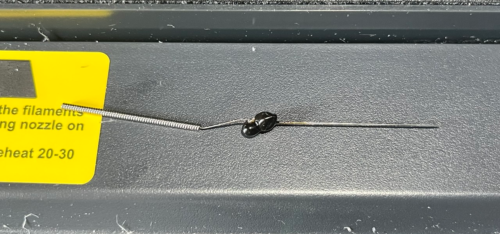

# Nozzle Clog

- Date: 2026-04-29
- Printer: Sovol SV08
- Type: Incident
- Material: PLA
- Symptom: nozzle clog
- Status: cleaning attempt recorded, final outcome should be updated after the next successful print

## What happened

- Filament stopped flowing normally from the nozzle
- A clog was suspected in the nozzle or melt zone

## What I used

- Needle inserted from the bottom of the nozzle
- Tutorial reference: [How To Unclog A 3D Printer Nozzle](https://www.youtube.com/watch?v=zIimdq_HCjE)

## What I did

- Heated the nozzle to `240C`
- Inserted the needle from the bottom and tried to clear the blockage
- Waited about `20-30 minutes`
- Filament came out around the needle, but the cleaning attempt did not fully solve the issue

## Observations

- PLA was inside the nozzle during the clog
- The result suggests softened filament was moving, but the internal blockage was not fully cleared
- This may indicate the clog was not only at the nozzle tip

## Media

