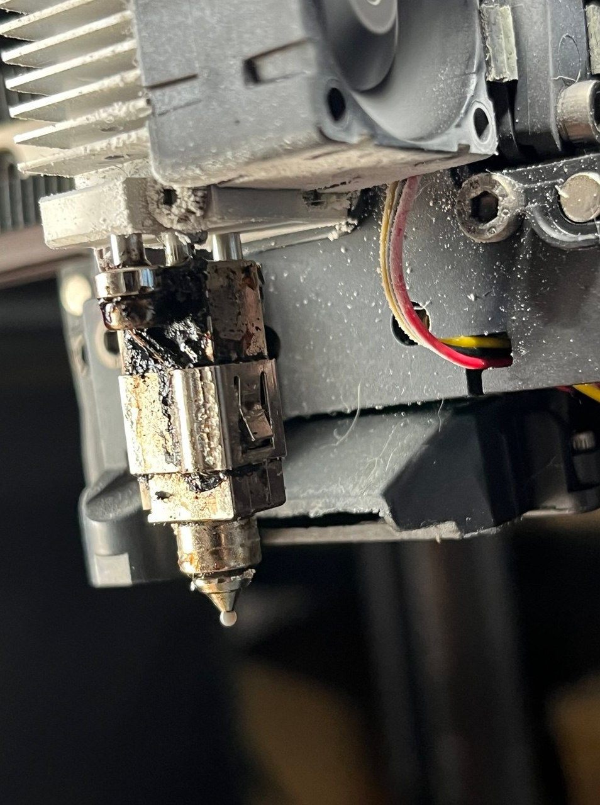
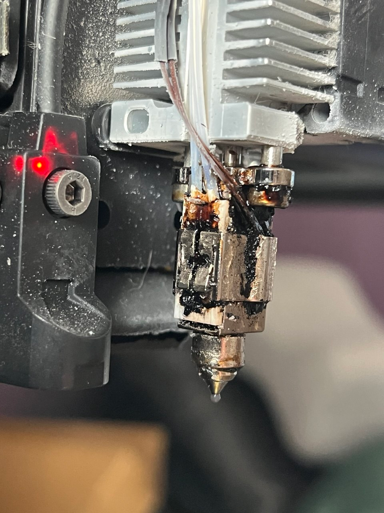

# Filament Leak Above Nozzle

- Date: 2026-04-30
- Printer: Sovol SV08
- Type: Incident
- Symptom: filament leaked out above the nozzle and flooded the silicone sock
- Status: root cause identified, final fix should be updated after reassembly and test print

## What happened

- Filament escaped above the nozzle area instead of exiting cleanly through the nozzle tip
- The silicone sock became flooded with molten filament
- Inspection showed the nozzle had loosened screws

## Result

- Confirmed root cause: loosened nozzle screws allowed the hotend sealing to fail (probably, due to vibrations during the printing process)

## Media

- Store incident media in [assets/incidents/2026-04-30-filament-leak-above-nozzle](../assets/incidents/2026-04-30-filament-leak-above-nozzle)
- Current images:
  - `image1.png`
  - `image2.png`

## Notes

- Leaks above the nozzle usually point to a sealing problem in the hotend stack, not only a normal tip clog
